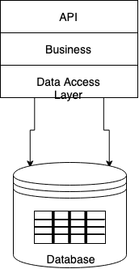
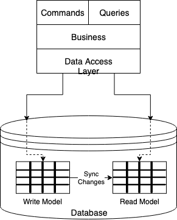
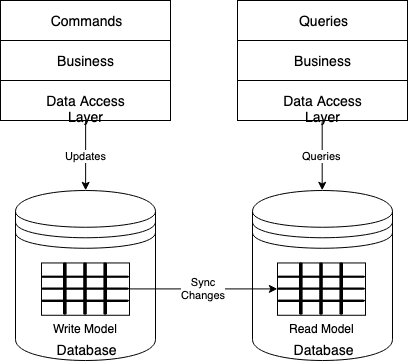
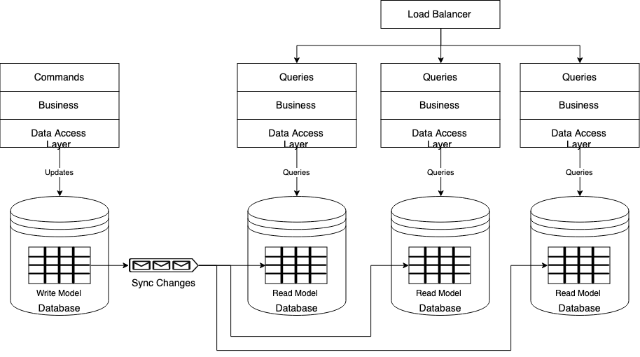

# Design Pattern

Design Pattern sind aus dem Vokabular unserer Community kaum noch wegzudenken. Gemeint sind damit empfehlenswerte Muster aus der Welt der Mikro-Architektur. Definiert sind sie als bewährte Lösungsschablonen für häufig auftretende Entwurfsprobleme. Durch den Einsatz solcher Muster verspricht man sich üblicherweise die folgenden positiven Effekte

* Design Pattern als bewährte Lösungsstrategie
* Verbesserung der Wartbarkeit
* Förderung der Modularität

### Decorator und Delegate

### Adpater

### Facade

### Observer

### Simple Factory

### Factory Method

### Abstract Factory

### Builder

# Microservice Pattern

## CQRS

In traditionellen, monolithischen Systemen werden sowohl schreibende Operationen (Änderungen an den Entitäten) wie auch schreibende Operationen (Anzeigen von Entitäten) gegen das gleiche Set von Objekten in einer Datenbank ausgeführt. Oft entsprechen die Entitäten einzelnen Zeilen in einer oder mehreren Tabellen in einer Relationalen Datenbank wie MySQL oder Oracle. 

Typischerweise werden in diesen Systemen alle CRUD (Create, Read, Update und Delete) Operationen gegen die selbe physische Repräsentation der Entitäten angewendet. Dabei werden die Daten oft als Data Transfer Object (DTO) modelliert, welches die In-Memory Instanzen der Daten repräsentiert, und diese werden von den Applikationen über einen zentralen Data Access Layer (DAL) geschrieben und gelesen. Dabei wird oft das selbe DTO für die schreibenden und lesenden Operationen verwendet. 

Dieser Ansatz für die Datennutzung ist relativ einfach zu implementieren und hat sich über die Jahre mit Unterstützung durch entsprechende Frameworks durchgesetzt. Er weisst aber ein paar Einschränkungen auf:

* Die Repräsentation der Entitäten die für die lesenden und schreibenden Operationen benötigt werden, sind für die übergeordneten Schichten (die Konsumenten) nicht immer identisch. Oft werden bei lesende Operationen mehr Daten benötigt als bei den schreibenden Operationen. 

* Auch wenn gleichzeitige Lesende Operationen grundsätzlich möglich sind, sobald eine schreibende Operation auf einer Entität stattfindet, müssen sich die lesenden Operation den Regeln der Data Isolation unterordnen, die die Applikation erwartet. Dies bedeutet das Synchronisation und Locking genutzt werden müssen, was die Skalierbarkeit einer Applikation deutlich limitiert. 

Beim CQRS Pattern werden die lesenden Operationen klar von den schreibenden Operationen getrennt und über separierte Interface abgehandelt. Dies impliziert, dass die Datenmodelle, die für die Abfrage der Entitäten und für die Änderungen an den Entitäten genutzt werden, auch unterschiedlich sein können, dies ist allerdings nicht ein absolute Anforderung. 

Wenn man sich für eine Trennung der Datenmodelle entscheidet, kann man sich auch dafür entscheiden, unterschiedlichen Schemas, unterschiedlichen Datenbank-Instanzen oder sogar unterschiedlichen Persistenztechnologien zu verwenden. Unabhängig davon ob es nur unterschiedliche Datenmodelle sind oder noch eine stärke Trennung gewählt wird, muss das Replizieren der Änderungen am Write Modell zum Read Modell adressiert werden.  

Wenn das Write Model und das Read Model getrennt werden, dann wird es typischerweise auch viel einfacher, der lesende Anteil an Operationen über mehrere Replikate zu skalieren, da es sich nun nur noch um Kopien bzw. Sichten auf das Write Modell handelt. In vielen Anwendungsfällen ist die Anzahl schreibender Operationen, die unterstützt werden müssen, viel geringer als lesende Operationen. In diesem Fall müssen die Write Modelle viel weniger skalierbar sein, als die Read Modelle. Der Grund, warum eine Write Modell über mehre Knoten erstreckt werden soll, ist oft vielmehr aus Gründen von Backup, Redundanz und Verfügbarkeit. 

As stated, the read store can be a read-only replica of the write store, and the read and write stores may have a different data structure altogether. Once you bring this separation between the read and write store, change synchronization has to be done from the write store to the read store.
Once you separate the write part from your read part of the data store, the synchronization must be done irrespective of whether these read and write stores are physically in the same node or in two different nodes. Consequently, once the synchronization mechanism is in place, the next natural instinct is to separate out the read and write computations into their own separate nodes or processes, as shown in Figure 5-3.

The moment you separate out the read and write services into different physical nodes, you are in effect grabbing the extra lever of “scale out” to address the high look-to-book ratio mentioned earlier by instantiating more of the read services and keeping a single instance of the write service. 

CQRS basiert auf zwei Konzepten, **Commands** und **Events**.

  * **Commands:** die Absicht, eine Änderung am Zustands einer Entität zu bewirken wird als Command modelliert. 

  * **Events:** sobald eine Zustandsänderung an einer Entität stattgefunden hat, wird dies als Event repräsentiert und andere können sich über den Event informieren lassen

Eine schreibende Transaktion, wird als Command repräsentiert und das Command Objekt kapselt alle Informationen, die für die entsprechende Zustandsänderung benötigt wird. Jede solche Zustandsänderung führt zu einer oder mehreren schreibenden Operation in der Datenbank. Diese Änderungen in der Datenbank können für andere Komponenten oder Services interessant sein und daher braucht es einen Mechanismus, wie diese Änderungen an die interessierten Parteien weitergeleitet werden können. Events sind ein gutes Mittel dafür. D.h. sobald eine Zustandsänderung auf einer Entität im Write Modell stattgefunden hat, wird diese über eine Event signalisiert und kann damit auch für die Propagierung zum Read Model genutzt werden. 

Vorteile von CQRS

* Hohe Skalierbarkeit
* Eignet sich zum Einsatz in Serviceorientierten Architekturen, etwa im Cloud Computing
* Schreib- und Lesezugriffe sind unabhängig voneinander skalierbar
* Verbesserte Sicherheit durch getrennte Rollen der Schreib- und Leseoperationen
* Simultaner Einsatz verschiedener Versionen derselben Software möglich
  * Beibehaltung von Rückwärtskompatibilität möglich
  * Migration auf neue Version im Live-Betrieb ohne Downtime möglich
* Anpassbarkeit an veränderte Business-Anforderungen
* Entwicklung der einzelnen Bestandteile durch unterschiedliche Teams
* Kann mit Event Sourcing kombiniert werden
* Transaktionen können wesentlich spezieller und isolierter ausgeführt werden
* Module, Klassen und Methoden sind wesentlich expliziter, da sie nur auf ganz spezielle Aufgaben fokussiert sind
* Die eigentliche Businesslogik wird nicht durch unnötige Abfragen aufgebläht
* Man kann sich mehr auf Konsistenz statt auf Skalierung konzentrieren
* Lesevorgänge erfordern kein kompliziertes und langsames Umwandeln komplexer Objektgraphen zu DTOs
* Es können hoch performante Abfragen erzeugt und eigesetzt werden
* Skalierung kann bei Abfragen praktisch unbegrenzt erfolgen
* Es können spezialisierte Persistenzmethoden für die jeweilige Aufgabe eingesetzt werden (DB, Key-Value-Store, DocDB, 1NF, 3NF)

Nachteile von CQRS

* Hoher Aufwand in der Softwareentwicklung. Eignet sich eher für Projekte mit vielen gleichzeitigen Benutzern.
* Benötigt passende Infrastruktur.
* Transaktionen sind schwer umzusetzen.
* Queries können durchgeführt werden, bevor Commands durchgeführt wurden. Es werden daher Versionierung und ein In-Memory-Cache benötigt um sicherzustellen, dass der Client Daten in der richtigen Version erhält.

    
It is to be noted that a CQRS-based architecture doesn’t mandate that you adopt a microservices architecture. Nor is a CQRS-based architecture mandatory to adopt a microservices-based architecture. Having said that, marrying these two will provide unique leverage for the software architect to scale the application with the ultimate flexibility.

## Event Sourcing

Event Sourcing ist eine Software-Architektur Konzept, das auf der Idee basiert, dass man sich nicht auf das Speichern des aktuellen Zustands einer Applikation konzentriert (CRUD Pattern), sondern dass man anstelle die Ereignisse speichert, die die Applikation in einen entsprechenden Zustand bringt. Das klassische Beispiel ist ein Bank System. Anstelle das man für jedes Konto nur den aktuellen Kontostand speichert und den bei jeder Transaktion entsprechend aktualisiert, wird jedes Ereignis (die einzelne Transaktion) gespeichert und der aktuelle Kontostand ist die Projektion dieser Ereignisse in der zeitlichen Abfolge. 

Auditierbarkeit ist der offensichtlichste Nutzen von Event Sourcing. Event Sourcing erhöht aber auch die Flexibilität. Man kann jederzeit zurückgehen und den gesamten Ereignisstrom nochmals abfragen und daraus neue Projektionen ableiten, an die man zuvor nicht gedacht hat. 

Vorteile von Event Sourcing

* Hohe Skalierbarkeit
* Einfache Anpassung an veränderte Business-Anforderungen
* Nachvollziehbarkeit, da alle Änderungen aufgezeichnet werden
* Jederzeit nachträgliche Datenanalyse möglich
* Deterministische Fehleranalyse möglich

Nachteile von Event Sourcing

Event Sourcing stellt sicher, dass alle Zustandsänderungen einer Applikation als Sequenz von Ereignissen gespeichert wird. 

---------

Auditability is the most obvious benefit of event sourcing, but it also gives you a lot of flexibility. You can go back and "query" the event stream to build up new projections of the original data you never would have thought to. Imagine a banking system where the values of an account were just stored as mutable entries in a database. Even ignoring the lack of an audit trail, you could never go back and ask questions like "what day do most of our transactions occur on". By storing the event stream, you can answer these questions even if you never thought to ask them when you designed the system.

Before we get into the nitty gritty of event sourcing, let's talk about the status quo of web development.
At it's heart, current web dev is database driven. When we design web apps, we immediately translate the specs into concepts from our storage mechanism. If it's MySQL we design the tables, if it's MongoDB, we design the documents. This forces us to think of everything in terms of current state, ie. "How do I store this thing so I can retrieve (and potentially change) it later?".

<https://dev.to/olibutzki/why-event-sourcing-is-a-microservice-anti-pattern-3mcj>

<https://www.innoq.com/en/blog/domain-events-versus-event-sourcing/>

<https://dev.to/barryosull/event-sourcing-what-it-is-and-why-its-awesome#5-composing-services-becomes-trivial>

