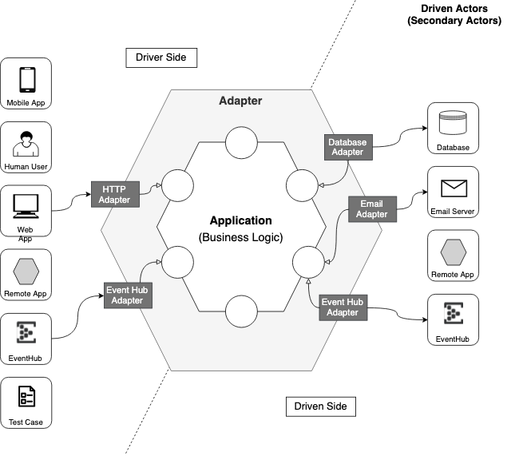

# Hexagonale Architektur

auch als **Onion-Architektur**, **Clean Architecture** bzw. **Ports and Adapters** bekannt

Die hexagonale Architektur wurde von Alistair Cockburn postuliert. Cockburn beschreibt die Absicht hinter dieser Architektur selbst mit folgenden Worten: *"Allow an application to equally be driven by users, programs, automated test or batch scripts, and to be developed and tested in isolation from its eventual run-time devices and databases."*

Es soll also eine Applikation geschaffen werden, die weder konkrete Annahmen darüber trifft wie bzw. von wem sie bedient wird (menschliche Interaktion, Skripte, etc.) noch wie die von ihr verwendeten Drittsysteme funktionieren. Wie kann man diesen Zustand erreichen?

## Das Hexagon

Ein wichtige Eigenschaft der hexagonalen Architektur ist das sie Probleme in 3 verschiedene Bereiche aufteilt: **User-Interface-**, **Applikation-/Domänen-** und **Infrastruktur-Logik**. Diese lassen sich grösstenteils unabhängig voneinander umsetzen.
Damit ist die Implementation einfacher zu verstehen und es gibt wendiger Abhängigkeiten zwischen den 3 verschiedenen Bereichen. 

Die Hexagonale Architektur basier auf den folgenden 3 Prinzipien bzw. Techniken:

* Explizite Trennung von Applikation, Domäne und Infrastruktur
* Abhängigkeiten gehen immer von der Applikation bzw. Infrastruktur zur Domäne
* Die Grenzen werden durch Port und Adapter isoliert

Das folgende Diagramm zeigt die Idee der Hexagonal Architektur in der Übersicht. 

Die drei Bereiche haben die folgende Bedeutung:

* **User Interface Side (links)**: Dies ist die Seite, über welche die Benutzer bzw. externe Programme mit der Anwendung interagieren. Es enthält den Code, der für die Interaktionen notwendig ist. Typischerweise handelte es sich hier um User Interface Code, um HTTP Aufrufe vom REST API, um Serialisierung der Nachrichten usw. Dies ist die Seite, wo man die Aktoren findet, die die Domäne **treiben**. 

* **Application / Domain (zentrum)**: Dieser mittlere Teil soll möglichst gut von der linken und rechten Seite isoliert sein. Er enthält den Code der die Anwendungslogik betrifft und implementiert. Im Zentrum soll nur die Domänensprache ([Ubiquitous Language](TBD)) verwendet werden. Idealerweise sollte ein Domänenexperte, auch wenn er kein Programmierer ist, einen Codeteil lesen können und auf Inkonsistenzen hinweisen können. 

* **Infrastructure Side (rechts)**: Hier finden wir die Dinge, die die Applikationen zum Funktionieren braucht. Sie enthält die wichtigen Infrastrukturdetails, wie z.B. der Code, der mit der Datenbank interagiert, eine Nachricht publiziert, der mit dem Filesystem interagiert oder aber einen HTTP Aufruf einer anderen Applikation ausführt, zu der eine Abhängigkeit vorliegt. Dies ist die Seite, wo sich die Aktoren finden, die von der Domäne **kontrolliert** werden. 

Im folgenden werden die Bereiche **Actors**, **Ports** und **Adapter** genauer beschrieben.

### Actors

Ausserhalb des Hexagon befinden sich die Dinge, mit der die Applikation interagiert. Dies Dinge können Personen, andere Applikationen oder Geräte sein. Diese sind die Aktoren. Man könnte auch sagen, dass die *Actors* die Umgebung der Anwendung darstellen. 

*Actors* sind links oder rechts vom Hexagon angesiedelt, abhängig davon wer die Interaktion zwischen der Application (in der Mitte) und den Actors anstösst.

* Actors auf der linken Seite sind die **Drivers** oder **Primary Actors**. Die Interaktion wird dabei immer vom Actor angestossen. 

* Actors auf der rechten Seite sind die **Driven Actors** oder **Secondary Actors**. Die Interaktion wird hier immer durch die Applikation angestossen. Ein **Driven Actor** stellt Funktionalitäten zur Verfügung, welche ei Applikation zur Umsetzung der Geschäftslogik benötigt. 
 
Die **Driven Actors** lassen sich zudem in zwei Arten unterteilen:

* **Repository:** Informationen werden an eine Repository gesendet, ein Repository kann aber auch Informationen liefern. Die Interaktion erfolgt meistens synchron. Ein Repository kapselt eine Datenbank oder ein anderes Storage Medium. 

* **Recipient:** Informationen werden bei einem Recipient nur gesendet und es kommt nichts zurück. Die Interaktion erfolgt immer asynchron. Dies kann z.B. das Publizieren einer Nachricht oder das Senden einer Email sein. 

Figure 1: Actors

### Ports

Die Interaktionen zwischen Actors und der Application finden an den Grenzen des Hexagons immer über Ports statt. Jede Gruppe von Interaktionen zu einem bestimmten Thema/Grund ist dabei ein einzelner Port. 

Ports sollten so nach dem Thema/Grund benannt werden und nicht nach der Technologie. Ein Port ist technologie-agnostisch und erst ein Adapter bringt eine entsprechende Technologie ins Spiel. 

* Dieser **Driver Port** ist für das "Hinzufügen von Produkten zum Warenkorb" verantwortlich
* Dieser **Driven Port** (repository) ist für das "zur Verfügung Stellen von Informationen zu den Kunden" verantwortlich
* Dieser **Driven Port** (recipient) ist für das "Senden von Notifikationen" verantwortlich
  
Ports stehen an der Grenze einer Applikation, im Bild oben sind die Ports an den **Kanten des inneren Hexagons** (der Geschäftslogik) angeordnet. Von Aussen, kann ein Actor immer nur über die Ports mit dem Hexagon interagieren, es gibt keinen Weg an diesen vorbei. Ports sind Schnittstellen (interfaces) die die Applikation der Aussenwelt anbietet um darüber mit der Applikation kommunizieren zu können. Eine Applikation folgt damit dem [Information Hiding](TBD) Prinzip. Die Ports **gehören zu der Applikation** und werden von der Applikation entworfen und verantwortet. 

Figure 1: Actors

**Driver Ports** bieten Applikationsfunktionalität nach draussen an. Sie stellen sozusagen die Grenze für die Nutzung der Anwendungsfälle der Applikation dar. Sie sind **das API** der Applikation.

Ein **Driven Port** ist eine Schnittstelle für ein Funktionalität, die die Applikation braucht, um die Geschäftslogik implementieren zu können. Eine solche Funktionalität wird vom **Driven Actor** zur Verfügung gestellt. Ein Driven Port ist damit das **SPI (Service Provider Interface)** welches von der Applikation benötigt wird. 

Abhängig von der Granularität, die bei der Gruppierung von Funktionalitäten angewendet wird, kann ein Port Interface mehr oder weniger Anwendungsfälle unterstützten. Wenn man strikt dem [Single Reponsibility Principle](TBD) folgt, dann werden viele Ports entstehen, wobei jeder Port nur genau einen spezifischen Anwendungsfall abdeckt. Eine andere Option ist das [Command Bus Pattern](TBD) auf Stufe Port zu verwenden, mit jeweils einem spezifischen Command Handler pro Anwendungsfall. Dies kann auch für Abfragen genutzt werden, so dass man das [CQRS Pattern](TBD) damit ebenfalls unterstützen kann. In diesem Fall würde ein Port für die Kommandos und ein Port für die Abfragen genutzt. 

### Adapters

Actors interagieren mit den Hexagon Ports über Adapter, welche eine spezifische Technologie implementieren und anbieten. Ein Adapter ist eine Software Komponente, die es erlaubt, über eine bestimmten Technologie mit den Ports zu interagieren. Zu einem spezifischen Port können mehrere Adapter existieren, die alle eine gewünschte Technologie implementieren und damit nutzbar machen. Adapter sind immer ausserhalb der Applikation. 

Figure 1: Driver Adapters (linke Seite) und Driven Adapters (rechte Seite)

Ein **Driver Adapter** nutzt einen Port Interface und konvertiert eine entsprechende technische Anfrage in eine technologie-agnostische Anfrage an Port.

Beispiele für einen **Driver Adapter** sind:

* Eine **GUI einer Desktop-Applikation**, welche den Driver Port über eine GUI Applikationen aufruft 
* Eine **MVC Web Applikation**, deren Controller der Adapter darstellt und die Aktion von den Views in Kommandos auf dem Driver Port umwandelt 
* Ein **Kommandozeilen Interface (CLI)**, welche Befehle, die über eine Terminal Schnittstelle eingegeben werden in Kommandos auf dem Driver Port umwandelt
* Ein **Rest API**, die REST Aufrufe von Aussen in Kommandos auf dem Driver Port umwandelt
* Ein **Event Subscriber**, der sich für bestimmte Events auf dem Event Hub anmeldet und bei jedem Auftreten eines Events, dieses Event in ein Kommando auf dem Driver Port umwandelt.
* Ein **Automatisiertes Test Framework**, das die Test Cases in Anfragen auf dem Driver Port umwandelt.

Für jeden **Driver Adapter** sollte es zumindest zwei Implementation geben: eine für den richtigen Treiber, der zur Laufzeit genutzt wird und eine zweite Implementation, um das Verhalten auf dem Port testen zu können. 

Ein **Driven Adapter** implementiert die Schnittstelle eines Driven Ports und konvertiert die technologie-agnostischen Methoden in die technologie-spezifischen Aufrufe. 

Beispiele für **Driven Adapter** sind:

* Ein **Mock Adapter**, der das Verhalten eines "richtigen" Adapter simuliert
* Ein **REST Adapter**, der eine Anfrage an eine Remote Applikation (ein andere Implementierung eines Hexagons) stellt. 
* Ein **SQL Adapter**, der den Port auf Zugriffe auf eine Datenbank umsetzt
* Ein **Email Adapter**, der eine Email versendet
* Ein **Event Publisher**, der eine Nachricht in eine Topic in einem Message Broker sendet

## Abhängigkeiten in der Haxagonalen Architektur

Die Hexagonale Architektur macht sowohl auf der *Driver Side* wie auch auf der *Driven Side* Nutzen vom Pattern [Configurable Dependency](TBD). In einer Actor-Application Interkation muss derjenige, welcher die Konversation startet, den Gegenpart kennen, damit er weiss, mit wem er "sprechen" soll. D.h. er muss eine **Configurable Dependency** auf dem Interface vorsehen, dass der Partner implementiert hat:

* **Driver Side:** Die Konversation wird von Seite Driver (Primary Actor) initiiert, d.h.  der Driver Adapter braucht eine **Configurable Dependency auf dem Driver Port**. D.h. er nutzt ein Interface, welches von der Applikation implementiert wird.

* **Driven Side:** The Konversation wird von der Applikation gestartet, d.h. die Applikation hat eine **Configurable Dependency auf dem Driven Port**. Dabei handelt es sich um ein Interface, welches vom Driven Adapter bzw. Secondary Actor implementiert wird. 

Die Abhängigkeiten sind damit wie im folgenden Diagramm dargestellt

## Haxagonale Architektur und Domain Driven Design

Die Hexagonale Architektur kann sehr gut im Zusammenspiel mit [Domain Driven Design](TBD) genutzt werden. In diesem Fall wird die Applikation mit den Mitteln von Domain Driven Design umgesetzt. D.h. es wird ein **Domain Model** gebaut, welches von den **Domain Service* und **Application Service** gekapselt wird.  

Die Hexagonale Architektur kann als fundamentale Architektur betrachtet werden und sie lässt sich sowohl in einem Monolithen aber auch in einer Microservices Architektur verwenden. In den weitern Kaptitel werden wir die Hexagonale Architektur im Kontext von Microservices betrachten. 

-----------
To Do: 

* Aufzeigen Testbarkeit
* Besprechen Adapter & Anti Corruption Layer

