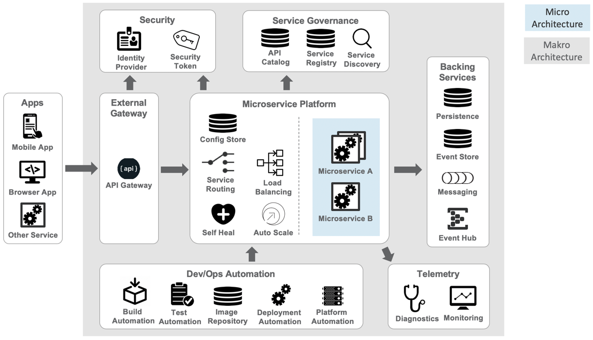

== Microservices Architecture

=== Two Architecture Viewpoints

*The micro architecture (also called Inner Architecture):* The software architecture of an individual micro service and what it exposes to the outside world.  Defined by the DevOps teams that develop, deliver and operate the services.

*The Macro Architecture (also called Outer Architecture):* The architecture of the Microservices infrastructure that provides a distributed operational and management platform on which the services are rolled out and executed. Defined, rolled out and operated by the Platform Ops team, supporting the work of the DevOps teams.

==== Macro Architecture

Due to the Inversion of Architecture, many of the concerns that used to be solved at the inner architecture level of the monolith now have become the outer architecture concerns.
Figure 1 attempts to show schematically the concerns we need to address at the outer architecture level of a Microservice.
Microservices interact with each other and this chattiness between process spaces increases the overall complexity. Concerns like fault tolerance, graceful retry, and alternate code execution are few among them and this necessitates strong management, monitoring, and control of Microservices at its outer architecture level.

The goal is to achieve agility of delivery, flexibility of deployment, and the precision of scalability in a Microservices architecture. In order to do this, a new set of concerns must be addressed and this increases the complexity of Microservices manyfold compared to that of a monolith.

[#macro-architecture]
[.text-center]
.Macro Architecture

==== Micro Architecture

The examples of different inner architectures shown in Figure 2 are not exhaustive, but show some of the most common patterns:

[#micro-architecture]
[.text-center]
.Micro Architecture
image::image/ms-inner-architecture.png[Micro architecture, align=center, title-align=center]

*Basic logic:* These Microservices are stateless and does not need a
persistence service. This type of service is used to perform
calculation-intensive jobs, such as calculating a tax or a discount. The
calculation is completely based on the parameters transmitted via the
Microservices API.

*Basic persistence:* These Microservices have their own encapsulated
persistence. If the data in the persistence changes, then events are
published that inform other services about the change. The persistence
mechanism belongs to the service and is shared by the different service
instances. This allows the service implementations to be stateless.

*Externalized persistence:* These Microservices use an external service
for persistence. This could be another Microservice with persistence
capabilities, or a dedicated persistence service that is part of the
platform infrastructure (e.g. a NoSQL datastore or RDBMS). If a
dedicated Data Persistence Service is used, it is important that it
allows isolation of the data the service possesses.

*Command Query Responsibility Segregation (CQRS):* These Microservices optimize the implementation of Read and Write operations.
The core idea of this pattern is the notion that you can use a different model to read information than to update information.
This architecture allows to separate the load between Read/Write operations and thus permitting to scale each one independently.
This pattern is particularly useful if your application sees a big disparity between Read and Write loads and since the service implementation is divided into two parts, different optimization techniques can be applied to both sides : for example different database strategies for Read and Write operations.

*Event handler:* These Microservices are controlled by events in the event hub.
The Microservice can also create new events and add them to the event hub to inform other services about its state to or APM tools.
Scalability is controlled by the Pattern ``competing consumers`` against a shared subscription.
